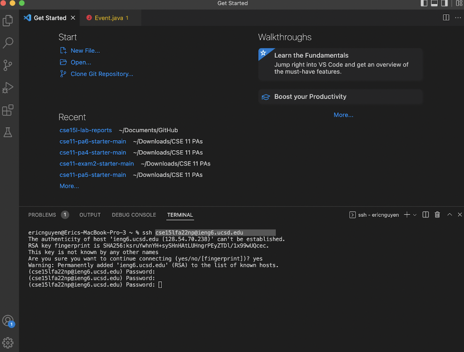
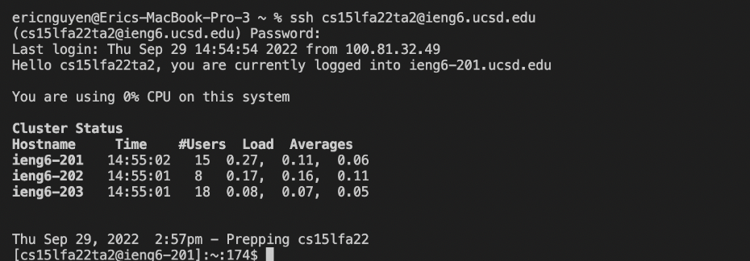
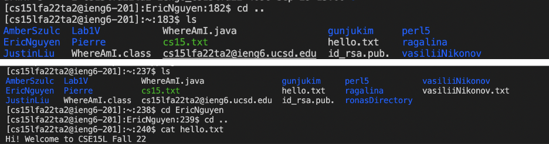
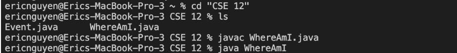
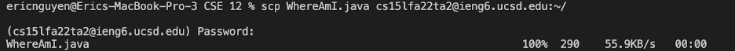
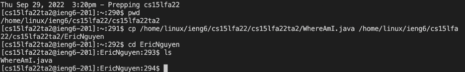
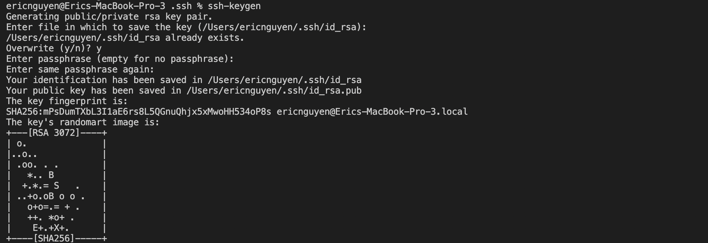
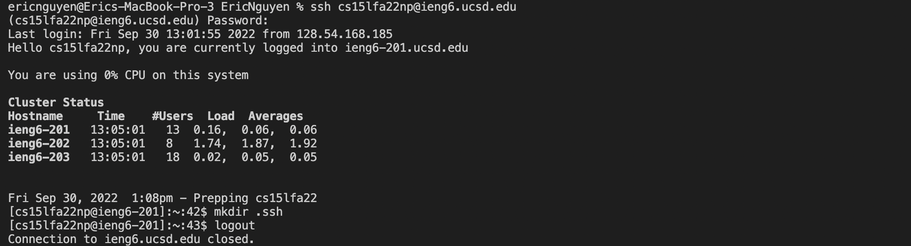
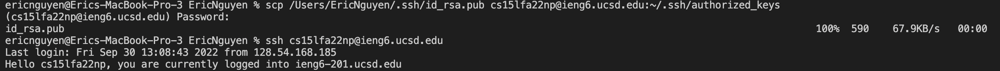
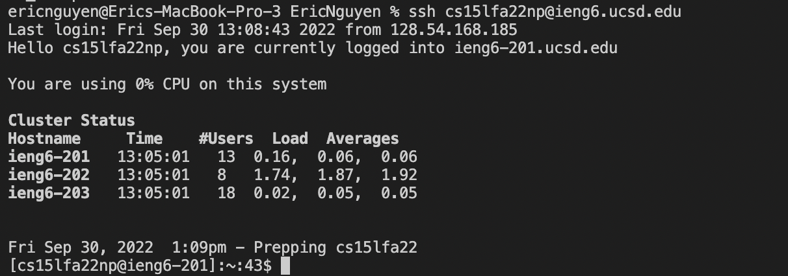

__Week 2 Lab Report Blog - Connecting to the Remote Server__

__Installing VS Code__

This step was not necessary for me as I had VS Code installed on my laptop before the course. Installing it was most likely a matter of going onto the page and following a set of instructions to get the download file.

__Remotely Connecting__

I used the ssh command to connect using my unique cse 15L account into one of UCSD's remote server. Since I was not able to log onto my own account during the lab hours, I had to use the TA login and password.

__Trying some Commands__
There were a couple of useful commands that I used:
_cd:_ allows you to enter directories through paths
_cat:_ writes out the lines in a text file
_mkdir:_ allows you to create a new directory with a certain name

__Moving Files with scp command__

I copied some code from the lab and put it into a file named WhereAmI.java, which allows the user to see the server, directory, and username of the current path. I used the scp command to then send the file to the ta's account on the remote server. Finally, I used the cp command in order to further move the file into my own personal directory.

__Setting an SSH Key__

To do this, I used the ssh-keygen command to create a pair of files that will act as my password: id_rsa and id_rsa.pub. 

After creating the key files, I logged onto the remote server using the ssh command made a directory called ".ssh". Once created, I could log out. A password was still needed in this step.

Creating the .ssh directory on the remote server now allows me to transfer over the files from the client to the remote. I used the scp command to transfer over the public passkey file (id_rsa.pub) to the respective directories. A password was still needed in this step.

Once the files were transferred, I was able to use the ssh command without having to use a passcode.

__Optimizing Remote Running__

I tested out running a single command (ls) on the remote server from the client. I found out that as long as there are no spaces in the command as a whole, you don't need quotation marks. To run multiple command on the remote server from the client, I needed to embrace the entire set of commands within quotation marks as to not confuse the terminal. I entered my EricNguyen directory and ran my WhereAmI.java file using this method.

