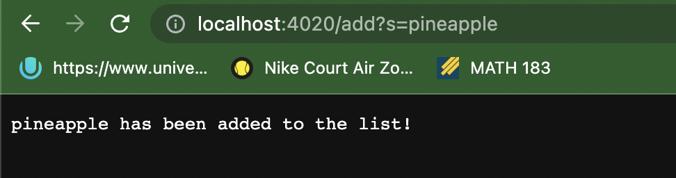
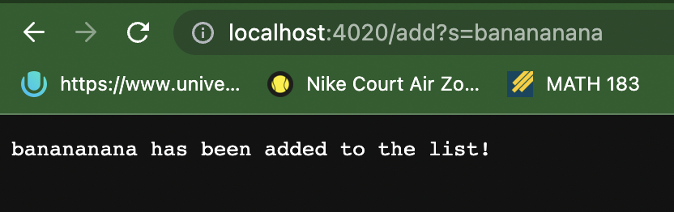
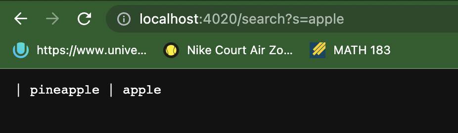

__Week 2 Lab Report Blog__

__Part 1__

The below code showcases the java file code for my SearchEngine.

```
import java.io.IOException;
import java.net.URI;
import java.util.ArrayList;


class Handler implements URLHandler {
    // The one bit of state on the server: a number that will be manipulated by
    // various requests.
    int num = 0;

    String test = "Welcome to this webpage. You can start by using the commands add or search.";
    ArrayList<String> sList = new ArrayList<>();

    public String handleRequest(URI url) {
        if (url.getPath().equals("/")) {
            return test;
        } else if (url.getPath().equals("/increment")) {
            num += 1;
            return String.format("Number incremented!");
        } else {
            System.out.println("Path: " + url.getPath());
            if (url.getPath().contains("/add")) {
                String[] parameters = url.getQuery().split("=");
                if (parameters[0].equals("count")) {
                    num += Integer.parseInt(parameters[1]);
                    return String.format("Number increased by %s! It's now %d", parameters[1], num);
                }
                if (parameters[0].equals("s")) {
                    sList.add(parameters[1]);
                    return String.format("%s has been added to the list!", parameters[1]);
                }
            } else if (url.getPath().contains("/search")){
                String[] parameters = url.getQuery().split("=");
                if (parameters[0].equals("s")) {
                    ArrayList<String> sListModified = new ArrayList<>();
                    for(String s : sList) {
                        if(s.contains(parameters[1])) {
                            sListModified.add(s);
                        }
                    }

                    String toReturn = "";

                    for(String s : sListModified) {
                        toReturn = toReturn + " | "+ s;
                    }
                    return toReturn;
                }
            }
            return "404 Not Found!";
        }
    }

}

class SearchEngine {
    public static void main(String[] args) throws IOException {
        if(args.length == 0){
            System.out.println("Missing port number! Try any number between 1024 to 49151");
            return;
        }

        int port = Integer.parseInt(args[0]);

        Server.start(port, new Handler());
    }
}
```

Adding Items into the array:


The method handleRequest is being called. In this case, the relevant values to this method are "/add", "s" and "pineapple". The argument "/add" is being detected by the url.contains method to call the specific command catered to the value "/add". The parameters array has the values "s" and "pineapples" input accordingly, where "s" represents that the value being used is a string and "pineapple" represents the string actually being input. When the method has been called, the "pineapple" string is added to the field sList.


The method handleRequest is being called. In this case, the relevant values to this method are "/add", "s" and "apple". The parameters argument is used in a very similar fashion to the statement made above. When called, the value in the first index of parameters is changed from "pineapple" to "apple" to account for the update. When the method has been called, the "apple" string is added to the field sList.



The method handleRequest is being called. In this case, the relevant values to this method are "/add", "s" and "banananana". The parameters argument is used in a very similar fashion to the statement made above. When called, the value in the first index of parameters is changed from "apple" to "banananana" to account for the update. When the method has been called, the "banananana" string is added to the field sList.



The method handleRequest is being called. The relevant arguments is the parameters array. Being input as values into the array are "/search", "s", and "apple". The method updates the "/add" value to the "/search" value, which is being used to determine which action to execute. The "s" represents what type of query is being input (a String type) and the "apple" represents the query being input. 


__Part 2__
