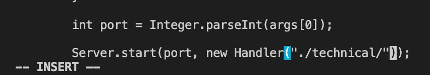

## Week 7 Lab Report Blog - Vim

__Part 1: Week 6 Task__

The task that I chose to do was the third one, which to change the main method to include input from the second command line argument in addition to the existing first command line argument input.

* `/main<ENTER>`

I used this command in order to immediately search for and take me to the main method. There is only one main method defined in the entire file, so it jumps to the one I am looking for.

* `/cal<ENTER>`

I used another search command to take me to the place where I will be inserting the second command line argument (after 'technical'). I use this after the /main search command because there are multiple instances of the phrase 'technical' in the file. This will jump specifically to the one I want.

* `5<RIGHT_ARROW>`

This command moves the cursor 5 spaces right in order to slightly adjust the cursor to the exact spot that I want. 

* `i`

This command changes me into insert mode so I can edit the file.

* `+args[1]<ESC>`

I type in the changes that I want to make, which is including the second command line argument, and then exit insert mode.

* `:wq`

This command saves and exits the file with the new changes. Our goal has been completed in 26 keystrokes, which may be close to 30 keystrokes but is a more realistic depiction of what I would do if I used vim and didn't know exactly where to look for.

__Part 2: Running Remotely__

* Using VS Code

Editing the file and running it on the external remote server took around 1:45 minutes. Most of the time was spent logging in and typing commands to make sure I was in the right directory. In my initial run, I didn't copy the file into the correct directory, which cost me a lot of time. Fixing everything would cost me time and a lot more typing in commands.

* Using Vim

Using vim was a lot faster, even if I wasn't in the remote server to begin with. While being in the remote server and running my premade set of vim commands, I was able to complete the task in 0:37 seconds. I presume that if I didn't know what the premade script was and if I wasn't already logged into the server, it would only be an extra 30 seconds maximum. The command route I chose is short yet still realistic if I didn't know the premade route.

* Conclusion

If the change I had to make was very small and I knew that it wouldn't cause any compilation errors, I would use vim. This task in particular leans towards favoring vim. Dealing with the plethora of commands when using VS Code was just inefficient considering that the change I made was so minor. I would use VS Code for much larger changes, like implementing a new method (and testing multiple different test cases to see that it works).