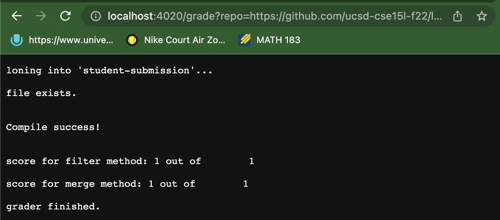
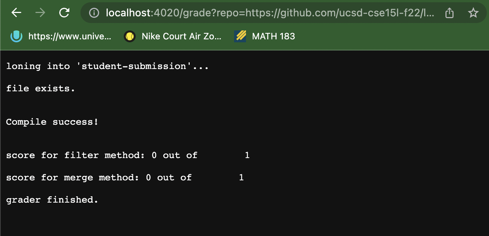
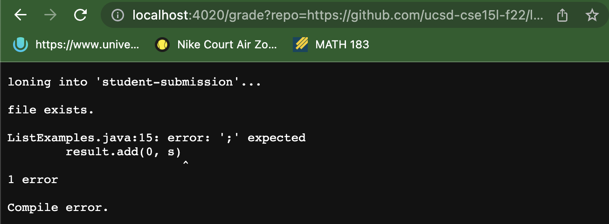

## Week 8 Lab Report Blog - Autograding script

__Part 1: Autograder Script__

This week's lab report will showcase a relatively simple bash script capable of autograding a given student submission of the implementation of the filter and merge method from ListExamples.java. It is able to print out the file output into a website using GradeServer.java and Server.java.

Below is my implementation of the autograder in a code block.

```
CPATH=".:lib/hamcrest-core-1.3.jar:lib/junit-4.13.2.jar"

rm -rf student-submission
git clone $1 student-submission
cp TestListExamples.java student-submission/

cp -r lib/ student-submission/lib/

cd student-submission

# checks to see if ListExamples.java exists in student-submission
if [[ -e "ListExamples.java" ]] 
then 
    echo
    echo "file exists." 
    echo
else 
    echo
    echo "ListExamples.java does not exist." 
    echo
    exit
fi

 # check to see if it compiles
javac ListExamples.java

if [[ $? -eq 0 ]]
then 
    echo
    echo "Compile success!" 
    echo
else 
    echo
    echo "Compile error." 
    echo
    exit
fi

javac -cp $CPATH *.java
java -cp $CPATH org.junit.runner.JUnitCore TestListExamples > stdout.txt

COUNT_FILTER_TESTS=$(grep -o "ListExamples.filter(" TestListExamples.java | wc -l)
COUNT_MERGE_TESTS=$(grep -o "ListExamples.merge(" TestListExamples.java | wc -l)

COUNT_FILTER=$(grep -o "testFilter" stdout.txt | wc -l)
COUNT_MERGE=$(grep -o "testMerge" stdout.txt | wc -l) 
PASSED_FILTER=$(($COUNT_FILTER_TESTS-$COUNT_FILTER/2))
PASSED_MERGE=$(($COUNT_MERGE_TESTS-$COUNT_MERGE/2))

echo
echo "score for filter method: $PASSED_FILTER out of $COUNT_FILTER_TESTS"
echo
echo "score for merge method: $PASSED_MERGE out of $COUNT_MERGE_TESTS"
echo
echo "grader finished."
exit
```

__First check of autograder__
Student Submission Link: https://github.com/ucsd-cse15l-f22/list-methods-corrected

Here is the screenshot of the autograder accepting the submission, which should return a full score with its complete and correct student implementation.



__Second check of autograder__
Student Submission Link: https://github.com/ucsd-cse15l-f22/list-methods-lab3

Here is the screenshot of the autograder accepting the submission, which should return a 0/2 total score because the methods are implemented incorrectly.



__Third check of autograder__
Student Submission Link: https://github.com/ucsd-cse15l-f22/list-methods-compile-error

Here is the screenshot of the autograder accepting the submission, which should return a compilation error because the file implementation is missing a semicolon.



---

__Part 2: Tracing the autograder script__

We will trace the autograder using the third check. The trace will be given below for any line containing a conditional or a command.

Line 3 (rm Command): 
stdout: (none)
stderr: (none)
return code: 0

Line 4 (git clone Command): 
stdout: (none)
stderr: Cloning into 'student-submission'...
return code: 0

Line 5 (cp Command): 
stdout: (none)
stderr: (none)
return code: 0

Line 7 (cp Command): 
stdout: (none)
stderr: (none)
return code: 0

Line 9 (cd Command): 
stdout: (none)
stderr: (none)
return code: 0

Line 12 (Conditional): 
This line evaluates whether the file "ListExamples.java" exists. Since the file does indeed exist, it returns true.

Line 14 (echo Command):
stdout: 
stderr: (none)
return code: 0

Line 15 (echo Command):
stdout: file exists.
stderr: (none)
return code: 0

Line 16 (echo Command):
stdout: 
stderr: (none)
return code: 0

Lines 18-21 do not run because the conditional statement does not fulfill the category to allow them to run.

Line 25 (javac Command):
stdout: (none)
stderr: 
ListExamples.java:15: error: ';' expected
        result.add(0, s)
                        ^
1 error
return code: 1

Lines 29-31 do not run because the conditional statement did not produce the correct boolean in order to fulfill their run statements.

Line 33 (echo Command):
stdout: 
stderr: (none)
return code: 0

Line 34 (echo Command):
stdout: Compile error
stderr: (none)
return code: 0

Line 35 (echo Command):
stdout: 
stderr: (none)
return code: 0

Line 36 (exit Command):
stdout: (none)
stderr: (none)
return code: 0

All lines past line 36 (lines 37-56) will not run because the early exit is called.

This ends the trace of the file.
